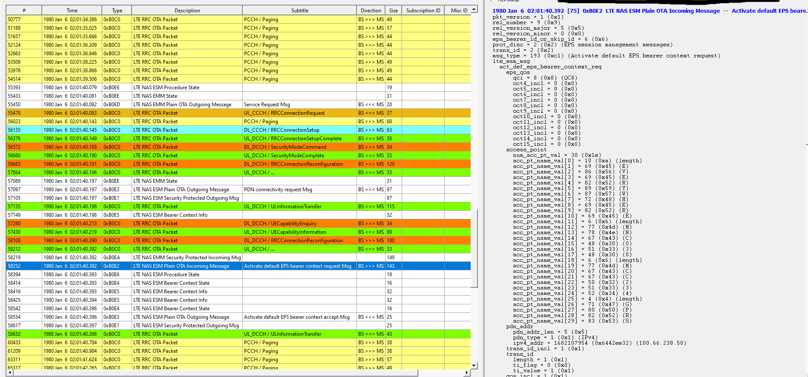

I've just captured using Legato cm (cm data connect) to activated context 3


## Equipment
RPi4 Bullseye os
WASP PCA + WP7607 

## Procedure

RPI -> Start the capture
```
sudo ./dmcapture.sh -a arm -d /dev/ttyUSB0 -l  -f filters/MC7xxx_GSM_GPRS_EDGE_WCDMA_LTE_DATA_EVDO_SMS.sqf -o testWP76_cm.qmdl
```

RPI-> shell into the WP->  and then start context 3
```
ssh root@192.168.2.2
```

Check the context settings - note the index
```
root@swi-mdm9x28-wp:~# cm data
Index:                         3
APN:                           everywhere
PDP Type:                      IPV4
Connected:                     no
Auth type:                     PAP
User name:                     eesecure
Password:                      secure
```

Activate context 3
```
cm data connect
```


## Results

After the successful connection -  (ignore context 2 that's me messing with at+cgact)

RPI-> 
```
minicom root@192.168.2.2
```


Check the contexts and modem reported IP addresses

```
> at+cgact?
> +CGACT: 1,1
> +CGACT: 2,1
> +CGACT: 3,1

> AT+CGPADDR
> +CGPADDR: 1,100.67.208.145
> +CGPADDR: 2,0.0.0.0
> +CGPADDR: 3,100.66.238.50
```




# Initial radio startup

RPI-> shell into the WP  
```
ssh root@192.168.2.2
```
WP-> Radio off  
```
cm radio off
```


RPI -> Start the capture  
```
sudo ./dmcapture.sh -a arm -d /dev/ttyUSB0 -l  -f filters/MC7xxx_GSM_GPRS_EDGE_WCDMA_LTE_DATA_EVDO_SMS.sqf -o testWP76_cmRadioOn.qmdl
```

[Log file captured](./testWP76_cmRadioOn.qmdl)

WP-> Radio on  
```
cm radio on
```

Check to see if context 1 auto activated
```
at+cgact?
+CGACT: 1,1
+CGACT: 2,0
+CGACT: 3,0

AT+CGPADDR
+CGPADDR: 1,100.73.205.66
+CGPADDR: 2,0.0.0.0
+CGPADDR: 3,0.0.0.0
```


OK 
